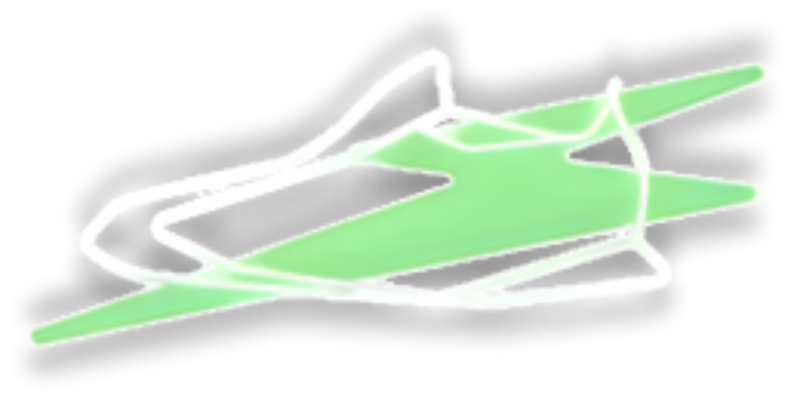

# 🎨 SOLE SOURCE - Panduan Instalasi Lengkap (UPDATED dengan Sidebar)

## 📦 File yang Sudah Siap Download:
1. ✅ **index.html** - File HTML (dengan sidebar & semua `` tag)
2. ✅ **style.css** - File CSS (dengan styling sidebar)
3. ✅ **script.js** - File JavaScript (dengan fungsi sidebar)
4. ✅ **PANDUAN_INSTALASI_SIDEBAR.md** - File ini

---

## 🗂️ Struktur Folder yang Harus Dibuat:

```
📁 SoleSource/
├── 📄 index.html
├── 📄 style.css
├── 📄 script.js
├── 🖼️ background.png              ← Background utama
├── 🖼️ menu-icon.png              ← Icon menu (header)
├── 🖼️ search-icon.png            ← Icon search (header)
├── 🖼️ logo.png                   ← Logo (footer)
├── 🖼️ logo-sidebar.png           ← Logo (sidebar) **BARU**
├── 🖼️ close-icon.png             ← Icon X close (sidebar) **BARU**
├── 🖼️ arrow-right.png            ← Icon arrow (sidebar menu) **BARU**
├── 🖼️ instagram-icon.png         ← Icon Instagram (footer)
├── 🖼️ whatsapp-icon.png          ← Icon WhatsApp (footer)
└── 🖼️ twitter-icon.png           ← Icon Twitter (footer)
```

---

## 📋 Daftar PNG yang Dibutuhkan (UPDATE):

### **Header Icons:**
| Nama File | Ukuran | Keterangan |
|-----------|--------|------------|
| `menu-icon.png` | 40×40px | Icon menu hamburger (kiri atas) |
| `search-icon.png` | 14×14px | Icon kaca pembesar (search bar) |

### **Sidebar Icons (BARU):**
| Nama File | Ukuran | Keterangan |
|-----------|--------|------------|
| `logo-sidebar.png` | 60×60px | Logo di sidebar (atas) |
| `close-icon.png` | 20×20px | Icon X untuk tutup sidebar |
| `arrow-right.png` | 18×18px | Icon arrow (6 buah untuk setiap menu) |

### **Footer Icons:**
| Nama File | Ukuran | Keterangan |
|-----------|--------|------------|
| `logo.png` | 100×40px | Logo footer |
| `instagram-icon.png` | 40×40px | Icon Instagram |
| `whatsapp-icon.png` | 40×40px | Icon WhatsApp |
| `twitter-icon.png` | 40×40px | Icon Twitter |

### **Background:**
| Nama File | Ukuran | Keterangan |
|-----------|--------|------------|
| `background.png` | 1920×1080px | Background utama |

---

## 🎯 Fitur Sidebar Menu:

### ✨ Cara Kerja:
1. **Klik icon menu** (kiri atas) → Sidebar muncul dari kiri
2. **Background menjadi gelap** (overlay dengan opacity 50%)
3. **Konten di belakang tidak bisa di-scroll** saat sidebar terbuka
4. **Klik tombol X** atau **klik di luar sidebar** → Sidebar tertutup

### 📐 Spesifikasi Sidebar:
- **Lebar**: 263px
- **Margin atas**: 36px
- **Margin bawah**: 38px
- **Background**: Biru gelap (#1a3a52)
- **Border radius**: 15px (kanan atas & kanan bawah)
- **Animation**: Slide dari kiri dengan smooth transition

### 📝 Menu Items (6 opsi):
1. Home
2. News
3. About
4. New Items
5. Popular Items
6. Contact Us

**Font**: Inter Semi Bold (18px)
**Spacing**: 24px antar menu item

### 🔘 Tombol Close (X):
- Background hijau (#9DF29C)
- Bentuk persegi dengan rotasi 45° (jadi terlihat seperti diamond)
- Border radius 10px
- Icon X di tengah

---

## 🚀 Langkah Instalasi (SAMA seperti sebelumnya):

### **Step 1-5:** Sama seperti panduan sebelumnya

### **Step 6: Siapkan PNG Baru untuk Sidebar**

Tambahkan 3 PNG baru:
- ✅ `logo-sidebar.png` (60×60px)
- ✅ `close-icon.png` (20×20px)
- ✅ `arrow-right.png` (18×18px)

### **Step 7: Test Sidebar**
1. Buka `index.html` di browser
2. **Klik icon menu** (kiri atas)
3. Sidebar harus muncul dari kiri
4. Background harus menggelap
5. **Klik X** atau klik di luar sidebar untuk tutup

---

## 📍 Lokasi PNG Sidebar di Code:

### 🔹 Logo Sidebar
**File:** `index.html` - Line ~40
```html

```

### 🔹 Close Icon (X)
**File:** `index.html` - Line ~48
```html

```

### 🔹 Arrow Icons (6x untuk setiap menu)
**File:** `index.html` - Line ~56, 60, 64, 68, 72, 76
```html

```
**Note:** Arrow yang sama dipakai untuk semua 6 menu item

---

## 🎨 Customization:

### Mengubah Warna Sidebar:
**File:** `style.css` - Line ~185
```css
.sidebar {
    background-color: #1a3a52;  /* Ganti warna di sini */
}
```

### Mengubah Lebar Sidebar:
**File:** `style.css` - Line ~186
```css
.sidebar {
    width: 263px;  /* Ganti lebar di sini */
}
```

### Mengubah Warna Close Button:
**File:** `style.css` - Line ~230
```css
.close-btn-bg {
    background-color: #9DF29C;  /* Ganti warna di sini */
}
```

---

## ⚠️ Troubleshooting Sidebar:

### Problem 1: "Sidebar tidak muncul saat klik menu"
**Solusi:**
- ✅ Pastikan `script.js` sudah di-load
- ✅ Buka Console (F12) untuk cek error
- ✅ Pastikan ID element benar: `menuBtn`, `sidebar`, `overlay`

### Problem 2: "Background tidak menggelap"
**Solusi:**
- ✅ Cek apakah overlay element ada di HTML
- ✅ Pastikan z-index overlay (998) lebih rendah dari sidebar (999)

### Problem 3: "Sidebar tidak smooth (patah-patah)"
**Solusi:**
- ✅ Gunakan browser modern (Chrome, Firefox, Edge, Safari)
- ✅ Pastikan `transition: left 0.3s ease;` ada di CSS

### Problem 4: "Bisa scroll konten padahal sidebar terbuka"
**Solusi:**
- ✅ Pastikan class `sidebar-open` ditambahkan ke `<body>`
- ✅ Cek CSS: `body.sidebar-open { overflow: hidden; }`

---

## 💡 Tips:

1. **Arrow PNG**: Buat 1 PNG saja, akan dipakai untuk semua 6 menu
2. **Logo Sidebar**: Bisa sama dengan logo footer, atau buat versi berbeda
3. **Close Icon**: Buat icon X sederhana, akan di-rotasi -45° otomatis
4. **Testing**: Test di berbagai device (desktop, tablet, mobile)

---

## ✅ Checklist Final (UPDATE):

- [ ] File `index.html` (dengan sidebar)
- [ ] File `style.css` (dengan sidebar styles)
- [ ] File `script.js` (dengan sidebar functionality)
- [ ] `background.png`
- [ ] `menu-icon.png`
- [ ] `search-icon.png`
- [ ] `logo.png`
- [ ] `logo-sidebar.png` **← BARU**
- [ ] `close-icon.png` **← BARU**
- [ ] `arrow-right.png` **← BARU**
- [ ] `instagram-icon.png`
- [ ] `whatsapp-icon.png`
- [ ] `twitter-icon.png`

---

## 🎉 Selamat!

Website Anda dengan fitur sidebar menu interaktif sudah siap! 🚀

**Fitur yang sudah ada:**
✅ Responsive header & footer
✅ Search bar
✅ Sidebar menu dengan animation
✅ Overlay background
✅ Click outside to close
✅ Prevent scroll saat sidebar terbuka
✅ Social media icons

---

## 🔄 Changelog:

**v2.0 (dengan Sidebar):**
- ✅ Added sidebar menu functionality
- ✅ Added overlay background
- ✅ Added close button with diamond shape
- ✅ Added 6 menu items with arrows
- ✅ Added scroll prevention when sidebar open
- ✅ Added smooth animations
- ✅ Added Inter font for menu items

**v1.0 (Initial):**
- ✅ Basic header & footer
- ✅ Background image support
- ✅ Responsive design

Good luck! 💪
